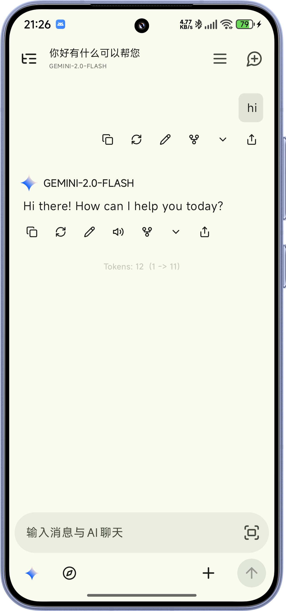

  
  <h1>RikkaHub</h1>

一個原生Android LLM 聊天客戶端，支持切換不同的供應商進行聊天 🤖💬

點擊加入我們的Discord伺服器 👉 [【RikkaHub】](https://discord.gg/9weBqxe5c4)

[English](README.md) | 繁體中文 | [简体中文](README_ZH_CN.md)

  
  

## 🚀 下載

🔗 [前往官網下載](https://rikka-ai.com/download)（推薦）
🔗 [前往 Google Play 下載](https://play.google.com/store/apps/details?id=me.rerere.rikkahub)

## 💖 贊助商

|                                         贊助商                                         | 介紹                                                                                                                                              |
|:-----------------------------------------------------------------------------------:|:------------------------------------------------------------------------------------------------------------------------------------------------|
|  <b>Aihubmix</b> | 感謝 <a href="https://aihubmix.com?aff=pG7r">aihubmix.com</a> 的資金支持。我們推薦使用 aihubmix 作為全球主流模型的一站式服務平台。（OpenAI、Claude、Google Gemini、DeepSeek、Qwen 以及數百種其他模型）。 |
|  <b>隨想AI網關</b> | 感謝隨想AI網關對本項目的贊助！隨想AI網關 是一家可靠高效的 API 中繼服務提供商，提供 Claude、Codex、Gemini 等的中繼服務。注重隱私的中轉站·無數據倒賣·無模型摻水，隱私，透明，極速售後。新帳戶註冊每日簽到就送 0.5 元測試額度，儲值額度 1:1，無需訂閱，按量付費。多線路冗餘、跨區域容災、自動故障切換，長鏈路 SSE 不中斷。99.9% 可用性，關鍵呼叫從不掉隊。 |

## ✨ 功能特色

- 🎨 現代化安卓APP設計（Material You / 預測性返回）和 🌙 暗色模式
- 📦 工作區：基於 proot 的 Linux 智能體環境
- 🖥️ Web多端訪問支持
- 🛠️ MCP 支持
- 🔄 多種類型的供應商支持，自定義 API / URL / 模型（目前支持 OpenAI、Google、Anthropic）
- 🖼️ 多模態輸入支持
- 📝 Markdown 渲染（支持代碼高亮、數學公式、表格、Mermaid）
- 🔍 搜尋功能（Exa、Tavily、Zhipu、LinkUp、Brave、Perplexity、..）
- 🧩 Prompt 變量（模型名稱、時間等）
- 🤳 二維碼導出和導入提供商
- 🤖 智能體自定義
- 🧠 類ChatGPT記憶功能
- 📝 AI翻譯
- 🌐 自定義HTTP請求頭和請求體

## ✨ 貢獻

本項目使用[Android Studio](https://developer.android.com/studio)開發，歡迎提交PR

技術棧文檔:

- [Kotlin](https://kotlinlang.org/) (開發語言)
- [Koin](https://insert-koin.io/) (依賴注入)
- [Jetpack Compose](https://developer.android.com/jetpack/compose) (UI 框架)
- [DataStore](https://developer.android.com/topic/libraries/architecture/datastore?hl=zh-cn#preferences-datastore) (
  偏好數據存儲)
- [Room](https://developer.android.com/training/data-storage/room) (數據庫)
- [Coil](https://coil-kt.github.io/coil/) (圖片加載)
- [Material You](https://m3.material.io/) (UI 設計)
- [Navigation 3](https://developer.android.com/guide/navigation/navigation-3) (導航)
- [Okhttp](https://square.github.io/okhttp/) (HTTP 客戶端)
- [kotlinx.serialization](https://github.com/Kotlin/kotlinx.serialization) (Json序列化)

> [!TIP]
> 你需要在 `app` 資料夾下添加 `google-services.json` 檔案才能構建應用。

> [!IMPORTANT]  
> 以下PR將被拒絕：
> 1. 添加新語言，因為添加新語言會增加後續本地化的工作量
> 2. 添加新功能，這個項目是有態度的
> 3. AI生成的大規模重構和更改

## 💰 捐贈

* [Patreon](https://patreon.com/rikkahub)
* [愛發電](https://afdian.com/a/reovo)

## ⭐ Star History

如果喜歡這個項目，請給個Star ⭐

## 📄 許可證

[License](LICENSE) 
